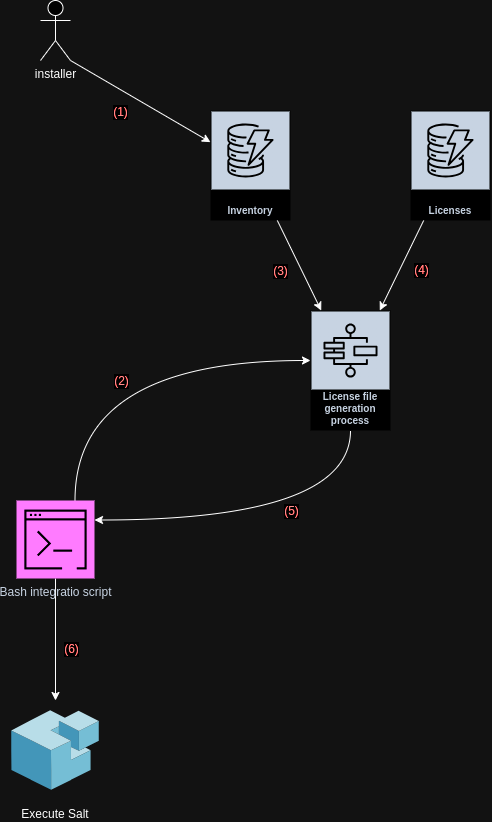

<!---
# This file is part of the IVMS Online.
#
# @copyright 2023 © by Rafał Wrzeszcz - Wrzasq.pl.
-->

# Salt extraction flow

This repository contains tools and mechanisms that synchronize **Salt** states for desired machine.

Information about all customization and verified licenses are stored in dedicated file in JWT format that uses known
hardware identifiers for unique signature.

1.  During physical installation list of required characteristics (to be defined) is saved in
    [inventory](https://github.com/ivms-online/ivms-inventory-service) storage - once in cloud it can be used by sync
    processes in the future.
1.  When Salt execution is needed to install/deploy system integration script requests JWT file from backend.
1.  Licenses generator takes all required inventory entries that will be used to generate signature that can afterward
    be us verified - as it relies on hardware identifiers it can only be verified by that particular hardware instance.
1.  Then all the licenses are loaded and added to the file.
1.  Generated file is returned to the client - CLI tool will save it in the location corresponding to node identifier
    so that SaltStack can find it.
1.  Once the file is obtained Salt can be triggered to deploy it into target system.
